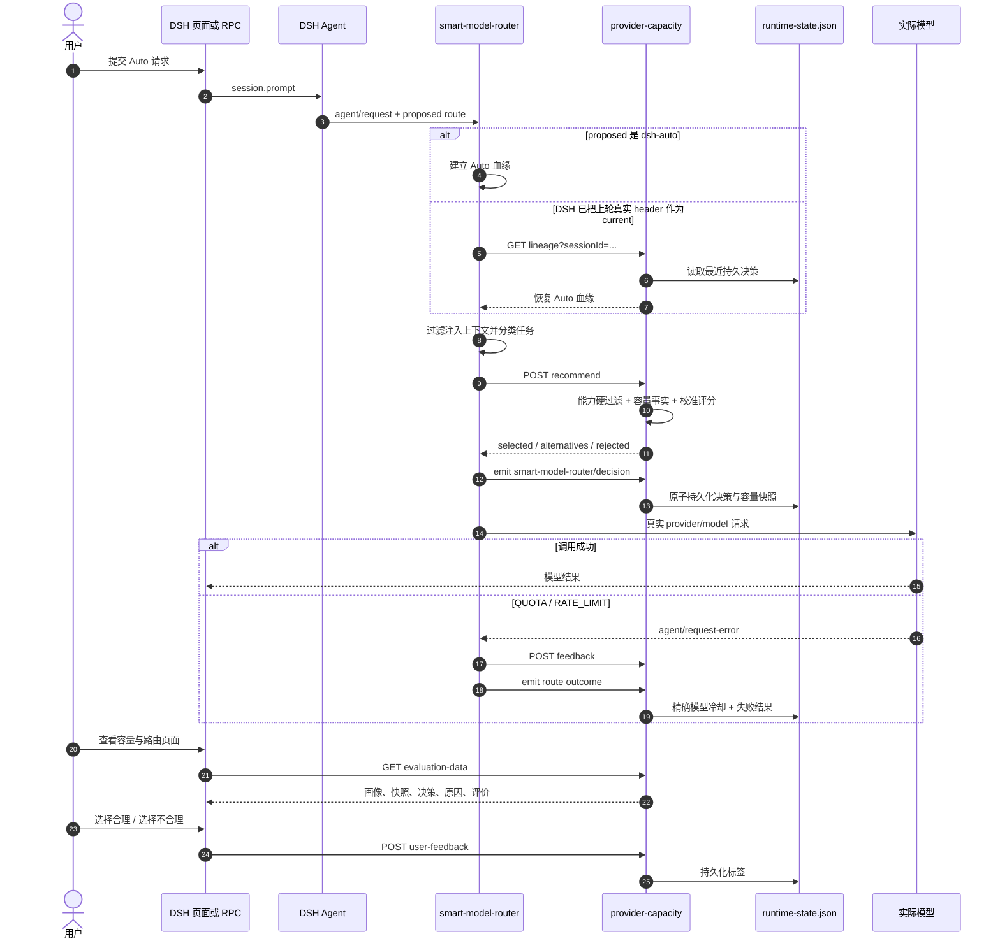

# DSH 可解释智能模型路由 v0.4

> 状态：正式知识  
> 日期：2026-08-27  
> 对应版本：`dsh-smart-model-router@0.4.0`、`dsh-provider-capacity@0.7.0`

## 1. 阶段目标

本阶段把 Auto 路由从“能选模型”推进为“选择有事实、失败可记忆、结果可评测、页面可解释”：

1. 图片模型真实额度失败不再只存内存，重启后仍然生效。
2. 模型画像、容量快照、路由决策、调用结果和人工评价进入同一个评测数据面。
3. 排序混合权重由离线评测校准，不通过另一个昂贵大模型承担全部路由。
4. DSH 设置页直接展示为什么选中、为什么淘汰、额度是否可靠，并允许标注选择是否合理。

## 2. 完整时序

## 3. 关键设计决策

### 3.1 Auto 是会话血缘，不只是一个模型字符串

真实验收发现，DSH 第一次把 `dsh-auto/dynamic` 路由成具体模型后，会把真实 `request/header` 作为会话当前模型。旧实现第二轮看到的 proposed 已是具体模型，因此绕过 Auto 和容量反馈。

v0.4 把 Auto 定义为会话血缘：

- 进程内用 WeakMap 保存上次 Auto 真实路由。
- 每条决策持久化 `sessionId`。
- DSH 重启后，路由器通过 `/api/provider-capacity/lineage` 恢复最近决策。
- proposed 等于上次 Auto 路由时继续自动选择。
- 用户切到不同具体模型时立即退出 Auto 血缘。

这样会话续问、重启恢复和精确额度冷却才能同时成立。

### 3.2 能力硬过滤先于评分

图片生成、视频生成、输入模态和最小上下文属于硬条件。没有图片生成能力的文本模型不会因为速度快或额度多而被选中；视频生成在当前无模型时直接 fail-closed。

### 3.3 额度失败按精确模型覆盖共享池

Antigravity 公开额度只显示共享 Gemini 池，但 `gemini-3.1-flash-image` 有独立隐藏额度。真实 429 会生成精确模型 `runtime-feedback`，其优先级高于乐观共享池；普通 `gemini-3.5-flash` 不受图片额度污染。

### 3.4 评分权重来自离线校准

当前评分混合策略：

| 分量 | 权重 |
| --- | ---: |
| 能力匹配 | 0.75 |
| 当前容量 | 0.05 |
| 画像证据与置信度 | 0.20 |

额度耗尽仍是硬拒绝，因此容量权重降低不会让不可用模型重新进入候选。提高证据权重可以避免尚未完成本地差分验证的新模型仅凭推测分数压过已有官方和真实证据的模型。

校准器执行网格搜索，输入包括提交的带标签案例，以及运行时被标记“选择合理/不合理”的决策。负向标签存在备选时，以首个备选作为校准目标；已明确失败的调用不作为正向样本。

## 4. 页面解释卡

“容量与配额”设置页升级为“容量与路由”，每条最近 Auto 决策展示：

- 最终 provider/model 和请求类型。
- 总分、会话粘性和调用失败状态。
- 贡献最高的评分维度。
- 主要备选模型及分差。
- 被硬过滤模型的首个淘汰原因。
- 容量状态、剩余比例和模型画像置信度。
- “选择合理”和“选择不合理”反馈按钮。

页面最多展示最近 10 条，持久层最多保留最近 500 条路由结果和 500 条人工评价。

## 5. 真实 DSH 验收

### 5.1 自动化

| 检查 | 结果 |
| --- | --- |
| 路由单元测试 | 20/20 |
| 旧版核心基准 | 12/12，100% |
| v2 边界基准 | 6/6，100% |
| 容量单元测试 | 13/13 |
| 离线校准 | 基线 100%，最优 100% |
| 容量 Host/Client 构建 | 通过 |

v2 首次运行暴露了“生成 1024×1024 PNG”没有出现“图片”二字时被判成文本的问题。扩展 PNG/JPEG/WebP/SVG 输出格式识别后由 5/6 修复为 6/6。

### 5.2 正式 DSH RPC

测试通过 DSH 页面使用的正式 Host RPC 完成，而不是伪造路由函数：

1. `session.create` 创建独立工作区会话。
2. `session.models` 确认当前为 `dsh-auto/dynamic`。
3. `session.prompt` 提交请求。
4. `session.history` 读取真实 `request/header`、工具事件和 `turn/end`。

| 场景 | 真实结果 |
| --- | --- |
| 简单文本 | `antigravity/gemini-3.5-flash`，完成 |
| 重启后同会话生产编码 | current 原为 Gemini，恢复 Auto 血缘后切到 `codex-chatgpt/gpt-5.6-sol` |
| 图片生成 | 正确命中 `gemini-3.1-flash-image`，上游返回 429 QUOTA |
| 图片失败事实 | 决策、失败 outcome 和精确模型冷却均持久化 |
| 重启后图片冷却 | 没有生成 `request/header`，路由层直接 fail-closed |
| 文本模型隔离 | 图片模型冷却不影响 Gemini 文本模型 |

图片产物仍未通过：路由和失败治理已经通过，但上游图片模型独立额度在本次补验时仍耗尽。额度恢复后需要再次运行同一正式 RPC 用例并验收实际附件。

## 6. 当前边界与下一步

1. P0 图片文件验收仍受外部额度阻塞，不能写成已生成成功。
2. 持久状态使用单进程原子 JSON 文件，适合当前本地 DSH；多进程部署需要 SQLite 或带锁存储。
3. 当前只明确记录失败 outcome；后续可监听完成事件，补齐成功、耗时、token 和用户中断。
4. 运行时错误 reason 可能较长，后续应保存结构化错误摘要并限制敏感诊断字段。
5. 轻量分类器应在真实标签达到足够规模后引入，先离线旁路比较，不直接替换规则。
6. 页面视觉自动化通道本轮不可调用；Host API、Client 构建与数据契约均通过，但最终像素级页面验收仍应补一张截图基线。

