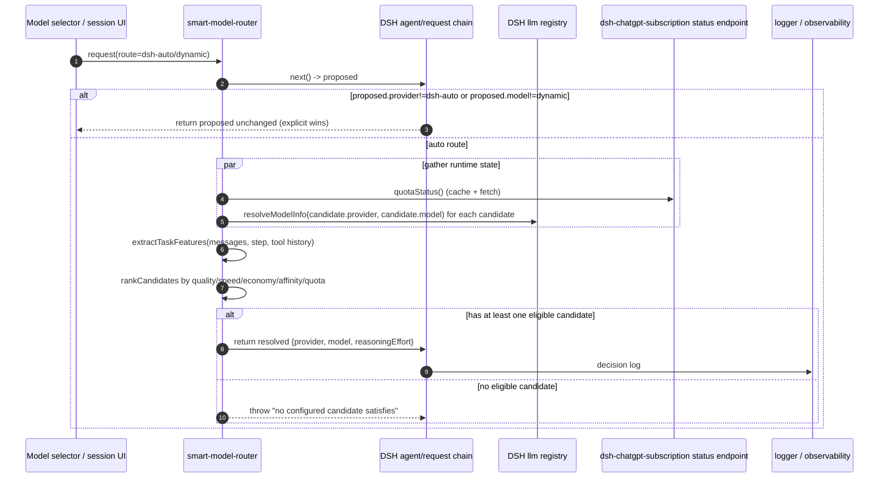
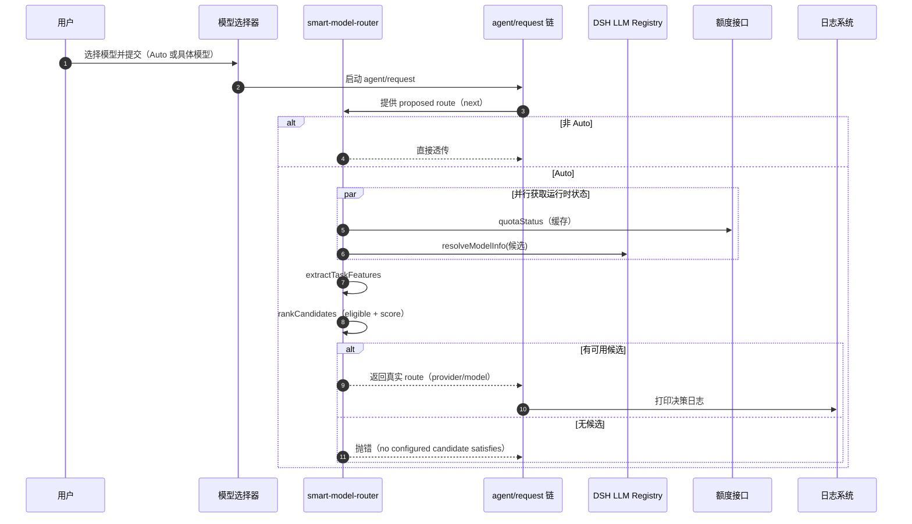

# Routing design

## Design basis

The router follows patterns established by open-source LLM routing work rather than treating prompt length as task difficulty:

- [RouteLLM](https://github.com/lm-sys/RouteLLM) frames routing as a calibrated quality-versus-cost decision learned from preference outcomes.
- [FrugalGPT](https://github.com/stanford-futuredata/FrugalGPT) demonstrates model cascades and budget-aware optimization.
- [Semantic Router](https://github.com/aurelio-labs/semantic-router) uses semantic intent classification before dispatch.
- [LiteLLM](https://github.com/BerriAI/litellm) separates model selection, budgets, health, cooldown, latency, and fallback policy.
- [NotDiamond RoRF](https://github.com/Not-Diamond/RoRF) predicts model suitability using learned nonlinear routing over prompt representations.

`dsh-smart-model-router` uses a dependency-light deterministic approximation suitable for an in-process Node plugin. It does not claim the accuracy of a trained RouteLLM or RoRF model.

## Decision stages

1. **Extract features:** semantic task families, constraints, current step, prior tool results, conversation size, image presence, high-risk terms, and agentic continuation signals.
2. **Resolve capabilities:** ask the live DSH `llm` registry for each candidate's availability and input modalities.
3. **Apply hard constraints:** reject unavailable models and text-only models for image-bearing sessions.
4. **Score utility:** combine configured quality, speed, economy, task affinity, live quota headroom, and reserve penalties.
5. **Select deterministically:** highest score wins; declaration order breaks exact ties.
6. **Explain:** log winner, score, demand, quota, and rejected candidates. The pure policy result also exposes components and alternatives for tests and future UI.

## End-to-end flow (what happens end-to-end)

Below is the complete execution chain in one request.

1. User opens the model picker and submits a request.
2. If model is not `dsh-auto/dynamic`, the plugin does not intervene and the explicit concrete route is used as-is.
3. If model is `dsh-auto/dynamic`, plugin resolves concrete route on `agent/request` after `next()`:
   1. Query in-flight quota snapshot (optional, cached, non-blocking on failure).
   2. Resolve model capabilities for all candidates through DSH LLM registry (`resolveModelInfo`), mainly availability and modality support.
   3. Extract structured task features from the latest user text + session signals.
   4. Compute eligibility, score all candidates, and rank.
   5. Return the winner candidate as the real route (`provider/model`).
4. DSH receives `request/header` with concrete provider/model and sends the actual LLM call.
5. Logger emits decision trace: winner, score, demand, quota, alternatives, and rejected reasons.
6. A virtual adapter safety net remains installed to prevent unresolved `dsh-auto` from reaching dispatch.

## Mermaid sequence (full flow, including guards)



## Decision logic in detail

The policy engine itself is intentionally deterministic and local.

1. Feature extraction (`extractTaskFeatures`)
   1. Latest user text: regex signals for coding, analysis, writing, risk, planning.
   2. Structural signals: message length, question marks, constraints, step depth, tool-result count.
   3. Modality signal: detects image blocks in message content.
   4. Outputs normalized features: `coding`, `analysis`, `writing`, `highRisk`, `agentic`, `longContext`, `simple`, `vision`, and `demand`.
2. Hard constraints (`eligibleCandidate`)
   1. Runtime unavailable -> rejected with reason `unavailable`.
   2. Candidate missing required modality when session contains image -> rejected with reason `missing:image`.
3. Utility score (`scoreCandidate`)
   1. `qualityWeight`, `speedWeight`, `economyWeight` are demand-adaptive.
   2. Demand-adaptive term:
      1. Higher demand => quality weight rises.
      2. Lower demand => speed/economy weights rise.
   3. `affinity` is dot product of candidate affinity vector and task features.
   4. `quotaScore` and `reservePenalty` are soft constraints that push away from low-headroom buckets.
4. Ranking (`rankCandidates`)
   1. keep all eligible candidates with component scores.
   2. reject list keeps reasons for all excluded candidates.
   3. sort by score descending, fallback to candidate declaration order.
5. Route resolution (`resolveAutoRoute`)
   1. If winner exists -> merge winner route into proposed and return.
   2. If no winner -> fail fast with explicit error.

## Tradeoffs and current assumptions

1. Deterministic heuristics make routing predictable and easy to audit, but they cannot adapt online like a learned policy.
2. Single-source quota coupling to ChatGPT subscription endpoint simplifies deployment but is a portability limitation.
3. Candidate quality/speed/economy values are operator estimates, so cross-project calibration is expected.
4. Capability checks are runtime-aware, but fallback for transient registry errors remains simple and non-retry.

## What to optimize next (priority roadmap)

1. High priority
   1. Add a learned route scorer fallback while keeping deterministic hard filters.
   2. Add candidate-level confidence or margin for tie and near-tie decisions to reduce jitter.
   2. Track and surface drift by logging baseline vs. resolved winner by day.
3. Medium priority
   1. Replace provider-specific quota endpoint with provider-neutral quota capability in DSH core.
   1. Move feature extraction into a versioned extractor pipeline for safer A/B changes.
4. Low priority
   1. Add latency-aware cost component from observed RTT.
   2. Add local replay evaluator to validate route quality vs. cost on regression corpus.
5. Hardening
   1. Add explicit timeout and single-retry policy in `resolveModelInfo` probing.
   2. Return structured decision object in observability event for dashboarding.
   3. Add policy guardrail for extreme quota depletion to force strongest available quality-capable candidate.

## Rollout and validation checklist

1. Unit-level
   1. Keep existing `core.test.js` and `plugin.test.js` parity.
   1. Add tests for quota service down, partial capability misses, and near-tie determinism.
2. Integration-level
   1. Smoke route in real DSH with Auto default session.
   2. Verify `request/header` contains resolved concrete provider/model.
3. Operational
   1. Ship with initial policy weights frozen.
   2. Measure candidate switch rate and cost/quality satisfaction trend.
   3. Trigger manual review if rejection ratio spikes.

## Utility function

For candidate `m` and extracted request features `x`:

```text
U(m, x) = quality(m) × Wq(x)
        + speed(m) × Ws(x)
        + economy(m) × We(x)
        + affinity(m, x)
        + quotaHeadroom(m)
        - reservePenalty(m)
```

Quality weight rises with request demand. Speed and economy weights fall as demand rises. Affinity is an explicit dot product over task signals such as coding, analysis, writing, vision, risk, agentic work, and long context. Quota is a soft utility term except below the configured reserve, where a nonlinear penalty protects the remaining pool.

## Capability evidence

The plugin distinguishes observed facts from operator estimates:

- Availability and input modalities come from the live adapter through `resolveModelInfo()`.
- Context windows and adapter defaults remain owned by DSH's LLM registry.
- `quality`, `speed`, `economy`, and affinity values are deployment policy estimates, not vendor benchmark claims. They are fully configurable.
- The default Codex candidates reflect their configured roles in this deployment; operators should replace them when better benchmark data or different providers are available.

## Evaluation

`benchmark/tasks.json` is a small transparent regression corpus, not a scientific quality benchmark. It prevents accidental policy drift across simple language work, ordinary coding, difficult debugging, architecture, research, and production-risk tasks. A production deployment should collect outcome labels and evaluate cost-quality curves on its own workload.

A future learned router can preserve the same architecture by replacing feature extraction or candidate quality prediction while retaining hard capability filters, quota utility, explicit override precedence, logging, and the benchmark interface.

## 中文版（完整补充）

### 端到端流程（完整链路）

1. 用户在模型选择器提交请求（可能选的是 Auto，也可能是具体模型）。
2. 先执行 `agent/request` 上游链路，拿到 `proposed route`。
3. 如果 `proposed` 不是 `dsh-auto/dynamic`，直接透传；`explicit selection` 永远优先，插件不改写。
4. 如果是 `dsh-auto/dynamic`，则执行自动路由流程：
   1. 并行拉取配额快照（可选，带缓存）；配额查询失败不阻塞路由。
   2. 并行查询候选能力（`resolveModelInfo`）：可用性与输入模态。
   3. 提取任务特征（最新用户文本 + step + 工具历史 + 约束 + 是否含图片）。
   4. 根据特征对候选进行硬过滤与多目标打分。
   5. 选出胜者，返回真实 `provider/model`（及 `reasoningEffort`）回给 DSH。
5. DSH 继续按重写后的 `request/header` 进行真实调用。
6. Logger 打印决策明细：胜者、最终得分、demand、配额、备选、被淘汰原因。
7. 虚拟 Adapter 若仍未解析（AUTO 未被替换）则触发 `AUTO_ROUTE_UNRESOLVED`，阻断 dispatch。



### 决策机制分解

1. 特征层：`extractTaskFeatures`
   - 抽取语义类信号：coding、analysis、writing、highRisk、planning。
   - 抽取结构类信号：文本长度、问题数、约束词、step、tool-result 数量、是否含 image。
   - 输出：`demand、coding、analysis、writing、highRisk、agentic、longContext、simple、vision`。
2. 能力层：`eligibleCandidate`
   - runtime 标记不可用 -> `unavailable` 直接拒绝。
   - 有图片且候选不支持 image -> `missing:image` 直接拒绝。
3. 打分层：`scoreCandidate`
   - `quality/speed/economy` 三项随 demand 自适应调整权重。
   - `affinity` 为候选 affinity 与任务特征的点积。
   - `quota` 为软约束：低剩余额度时加惩罚项。
4. 排序层：`rankCandidates`
   - 通过者进入 rank，淘汰记录保留 reason。
   - 分数降序；同分按候选顺序。
5. 落定层：`resolveAutoRoute`
   - 有胜者：与 proposed 合并后返回具体模型。
   - 无胜者：抛错中断。

### 待优化方向（按优先级）

1. 高优先级
   - 增加学习型路由器（如 RouteLLM/RoRF）作为可选替代，但保留硬约束和显式优先级。
   - 增加决策置信度/边界，抑制近似平局抖动。
   - 增加日度漂移监控（目标 vs 实际胜者差异）。
2. 中优先级
   - 解耦配额来源，走 DSH provider-neutral 配额能力。
   - 将特征抽取独立为版本化 pipeline，便于 A/B 与回滚。
3. 低优先级
   - 加入 RTT/实际延迟观测，增强 speed 的真实适配。
   - 完善回放评估（回归语料），形成 cost-vs-quality 报告。
4. 稳健性
   - 为 `resolveModelInfo` 增加超时与重试策略。
   - 打印结构化决策事件（供 dashboard）。
   - 加入极低配额保底策略，避免误选高消费/低剩余额度候选。

### 验证与上线

1. 单测
   - 继续保留 `core.test.js` / `plugin.test.js` 覆盖。
   - 补充配额服务缺失、局部能力缺失、近似平局测试。
2. 集成
   - 真实 DSH smoke：验证 Auto 默认会话可路由。
   - 验证 `request/header` 真实写入。
3. 运维
   - 先冻结权重上线，观察 candidate switch / 成本占用 / 命中率。
   - 淘汰率异常上升触发手工排障。
