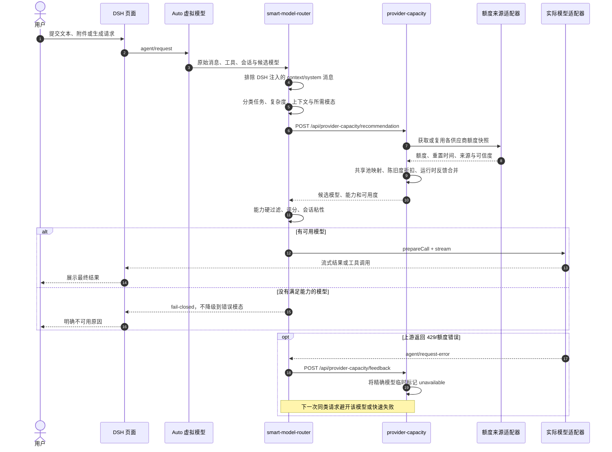

# DSH 智能模型路由联合验收报告

> 日期：2026-08-27  
> 范围：`dsh-smart-model-router`、`dsh-provider-capacity`、`dsh-antigravity` 与最新版 DSH 的联合运行链路  
> 结论：核心路由、会话粘性、运行时能力过滤、额度感知和失败反馈闭环通过；图片生成因 Antigravity 图片模型的上游独立额度耗尽，未产出图片，需在额度恢复后补验实际生成结果。

## 1. 本轮目标

这轮工作不是只验证“规则能否返回一个模型名”，而是验证 Auto 模式从页面请求到真实供应商调用的完整闭环：

1. 正确识别任务类型和任务复杂度。
2. 根据模型能力、上下文窗口和当前额度进行硬过滤与评分。
3. 在同一会话中保持合理的模型粘性，避免无意义跳模。
4. 对文本、生产级编码、长中文上下文、批处理、多模态理解、图片生成和视频生成分别采取合适策略。
5. 在上游返回额度错误后，把事实反馈给容量层，阻止短时间内重复撞击同一个不可用模型。
6. 保持最新版 DSH，不通过回退核心版本规避插件兼容问题。

## 2. 当前架构与职责

| 组件 | 职责 | 本轮版本 |
| --- | --- | --- |
| DSH | 页面、会话、插件生命周期、真实 Agent 调用 | `0.1.1-rc.2`，本地构建 `141eb6f` |
| `dsh-smart-model-router` | 请求分类、能力硬过滤、容量评分、会话粘性、失败反馈 | `0.3.4` |
| `dsh-provider-capacity` | 聚合供应商额度、模型能力画像、共享额度池、运行时反馈 | `0.6.1` |
| `dsh-antigravity` | Gemini/图片模型适配与附件传递 | `0.0.4` + 本仓库维护的兼容补丁 |

路由器不直接维护每一家供应商的额度抓取逻辑。容量插件负责把不同供应商的额度和模型画像归一化，路由器消费统一推荐接口。这样可以把“事实采集”和“策略决策”分开演进。

## 3. 完整调用时序

## 4. 核心设计思路

### 4.1 先做能力硬过滤，再做偏好评分

额度充足不能弥补能力缺失。路由顺序固定为：

1. 判断请求是纯文本、多模态理解、图片生成还是视频生成。
2. 校验候选模型是否注册、是否支持所需输入输出模态、上下文是否足够。
3. 对不满足硬条件的模型直接排除。
4. 对剩余模型结合任务匹配度、额度、数据新鲜度和会话粘性评分。

因此，视频请求在当前没有视频生成模型时会明确失败，不会被错误地转给文本模型。

### 4.2 事实层与策略层解耦

`dsh-provider-capacity` 负责回答“现在有哪些模型、能力是什么、额度如何”；`dsh-smart-model-router` 负责回答“这个请求现在该选谁”。新增供应商时优先扩展容量源和模型画像，不需要把抓取细节复制进路由器。

### 4.3 共享额度池与精确模型反馈并存

部分供应商只暴露账号级或模型族级额度，容量层会把它映射成共享池。共享数据用于日常排序；一旦某个精确模型真实调用返回 429，运行时反馈会以更高优先级覆盖该模型，避免一个图片模型的隐藏限额污染同供应商仍可用的文本模型。

### 4.4 会话粘性是稳定器，不是强制锁定

同一会话的后续请求在能力仍满足且分差不大时沿用原模型，以保留上下文风格并减少切换。如果新请求需要不同模态、上下文超限或原模型不可用，硬条件优先于粘性。

### 4.5 失败关闭而不是静默降级

图片生成和视频生成属于输出能力约束。找不到对应模型时必须 fail-closed；把生成请求交给普通文本模型虽然“有回答”，但语义上是错误成功。

## 5. 本轮实现与修复

### 5.1 路由器

- 过滤 DSH 自动注入的 runtime context、system reminder 和 injection 消息，避免它们污染用户任务分类。
- 区分纯文本、多模态理解、图片生成和视频生成。
- 生产级编码任务优先 Codex，超长中文资料优先 Kimi，大批量且成本/吞吐优先的编码任务优先火山。
- 图片生成优先 Antigravity 图片模型；视频生成在无能力模型时明确失败。
- 推荐接口默认超时由 3 秒提高到 8 秒，覆盖容量服务冷启动约 3.25 秒的实际刷新时间。
- 增加会话粘性和切换阈值。
- 增加结构化路由日志。
- 监听 `agent/request-error`，把 429、quota 和 rate-limit 反馈到容量插件。

### 5.2 容量插件

- 更新 GPT-5.6 系列画像。
- 正确区分图片输入能力和图片输出能力。
- 增加 Codex、Kimi、火山共享额度池映射。
- 对未知额度和陈旧快照应用保守折扣。
- 增加精确模型级运行时反馈接口。
- 运行时额度失败默认进入 5 分钟冷却，不影响同供应商其他模型。

### 5.3 Antigravity 兼容补丁

- 为最新版 DSH 补齐 `prepareCall(provider, model, signal)` 适配入口。
- 保留上传附件和工具结果图片的可解析引用，打通页面上传、`read_image` 和 Gemini 多模态输入链路。
- 补丁以 pnpm patched dependency 方式保存在仓库中，重装插件后仍可复现，不依赖直接修改 `node_modules`。

## 6. 自动化测试结果

| 项目 | 命令 | 结果 |
| --- | --- | --- |
| 路由器单元测试 | `npm test` | 19/19 通过 |
| 核心路由基准 | `npm run benchmark` | 12/12 通过，命中率 100% |
| 容量插件单元测试 | `npm test` | 11/11 通过 |
| 容量插件构建 | `npm run build` | 通过 |

构建仅出现 `tsdown external` 已废弃、建议迁移到 `deps.neverBundle` 的警告，不影响当前产物。

## 7. 本地 DSH 真实验收

| 编号 | 场景 | 预期 | 实际 | 结论 |
| --- | --- | --- | --- | --- |
| T1 | 简单中文解释，不调用工具 | Gemini Flash | `antigravity/gemini-3.5-flash` | 通过 |
| T1G | 同会话补充场景 | 保持原模型 | `antigravity/gemini-3.5-flash` | 通过 |
| T2 | 生产级 TypeScript 限流器方案 | Codex | `codex-chatgpt/gpt-5.6-sol` | 通过 |
| T3 | 百万 token 中文资料与历史决策 | Kimi | `kimi/kimi-k3` | 通过 |
| T4 | 10 万条分类、成本与吞吐优先 | 火山 | `volcengine/GLM-5.3` | 通过 |
| T5 | 上传图片并识别文字和相对位置 | Gemini 多模态 | 两轮均为 `antigravity/gemini-3.5-flash`，识别正确 | 通过 |
| T6 | 生成图片 | 图片生成模型 | 命中 `gemini-3.1-flash-image`，上游返回 429 QUOTA | 路由通过，产物未通过 |
| T6R | 图片额度失败反馈 | 精确模型进入冷却 | capacity 出现 ratio=0 的 runtime-feedback | 通过 |
| T6F | 冷却期再次生成图片 | 不再撞击上游 | 路由层快速 fail-closed | 通过 |
| T7 | 图片模型冷却后请求普通文本 | 文本模型不受污染 | `gemini-3.5-flash` 正常完成 | 通过 |
| T8 | 视频生成 | 无视频模型时明确失败 | 路由层快速 fail-closed | 通过 |

关键实测数据：

| 场景 | 输入 token | 输出 token | 总耗时 | 首 token |
| --- | ---: | ---: | ---: | ---: |
| 简单文本 | 15,306 | 475 | 6.28 秒 | 6.12 秒 |
| 会话续问 | 未单独记录 | 未单独记录 | 4.45 秒 | 4.41 秒 |
| Kimi 长中文路由 | 14,200 | 136 | 13.7 秒 | 9.11 秒 |

多模态测试使用确定性图片，图片文字为 `ROUTE TEST 824`，红色圆形位于蓝色矩形右侧。模型对两项均回答正确，且轨迹中可见 `read_image` 返回 `image/png`、640x360、5203 bytes。

## 8. 验收判定

核心 Auto 路由链路通过。文本、编码、长上下文、批处理、多模态理解、会话粘性、能力缺失时 fail-closed，以及额度错误反馈闭环均符合预期。

图片生成只完成了“正确选择图片模型、真实请求、识别额度失败、反馈精确模型、后续阻断”的闭环。由于上游图片模型独立额度耗尽，本轮没有生成图片文件，因此不能把图片产物验收标为通过。额度恢复后应重跑 T6，并补充产物格式、尺寸和内容一致性检查。

## 9. 已知限制与待优化项

| 优先级 | 项目 | 当前影响 | 建议 |
| --- | --- | --- | --- |
| P0 | 图片生成额度补验 | 尚无真实图片产物 | 额度恢复后自动重跑 T6，并保存轨迹和产物 |
| P1 | 运行时反馈仅存内存 | DSH/插件重启后冷却信息丢失 | 持久化到轻量数据库或配置存储，并按 resetAt 清理 |
| P1 | Antigravity 不暴露精确图片额度 | 共享额度看似充足但图片模型仍 429 | 优先接入精确模型额度；无接口时延长基于错误的自适应冷却 |
| P1 | 规则仍以启发式为主 | 新表达方式可能误判 | 用真实轨迹持续扩充带标签评测集，按混淆矩阵调权重 |
| P1 | 冷启动刷新较慢 | 首次推荐约 3.25 秒 | stale-while-revalidate，启动时预热，单源超时隔离 |
| P2 | 固定 5 分钟额度冷却 | 与真实重置时间可能不一致 | 解析响应头和供应商错误字段，采用指数退避和精确 resetAt |
| P2 | 运行轨迹可观测性 | 用户需要进入 trajectory 才能确认命中 | 页面展示路由决策卡：任务类型、候选、淘汰原因、额度和最终模型 |
| P2 | v2 测试集尚未接入 benchmark runner | 新边界案例不能统一计算命中率 | 让 runner 读取版本化 JSON，并输出回归差异和混淆矩阵 |
| P2 | 火山调用期间出现较长推理展示 | 可能影响页面体验或泄露适配器中间态 | 检查 reasoning channel 与 final channel 的映射和 UI 展示策略 |
| P3 | Antigravity 补丁依赖上游旧版本 | 上游升级可能产生补丁冲突 | 跟踪上游正式兼容版本，升级后删除本地补丁并做回归测试 |

## 10. 下一阶段建议

1. 先把 P0 图片生成补验和 P1 反馈持久化完成，保证运行事实可靠。
2. 将模型能力画像、额度快照、真实路由结果和用户反馈统一为评测数据。
3. 用离线评测校准规则和权重，再逐步引入轻量分类模型，不直接用另一个昂贵模型替代全部路由逻辑。
4. 最终把“为什么选它、为什么没选其他模型、额度是否可靠”直接展示在 DSH 页面，形成可解释的自动勾选能力。

